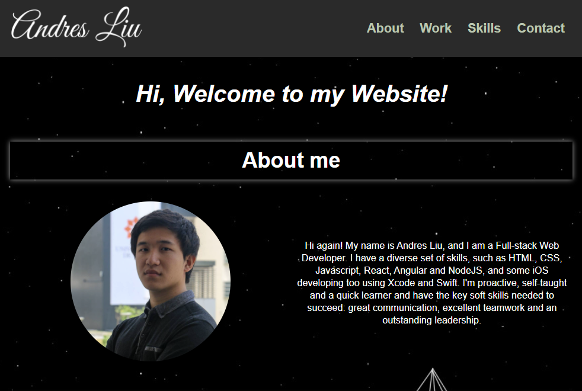

# Hi, my name is Andres Liu and this is my portfolio!

## About me

* I am a Full-stack Web Developer. I'm proactive, self-taught and a quick learner and have the key soft skills needed to succeed: great communication, excellent teamwork and an outstanding leadership.

## Site Picture

## My Work

* Code Refactor
[Link to Project](https://github.com/andresliu22/code-refactor)
* Responsive Grid
[Link to Project](https://github.com/andresliu22/responsive-grid)
* Initiative
[Link to Project](https://github.com/andresliu22/initiativeApp)
* UM
[Link to Project](https://github.com/andresliu22/umApp)
* News
[Link to Project](https://github.com/andresliu22/newsApp)
* Covid-tracker
[Link to Project](https://github.com/andresliu22/covid-tracker)
* Tasks
[Link to Project](https://github.com/andresliu22/tasksApp)
* Reminder
[Link to Project](https://github.com/andresliu22/reminderApp)
* BMI Calculator
[Link to Project](https://github.com/andresliu22/bmiCalculator)

## Skills

* HTML
* CSS
* Javascript
* Angular
* React
* NodeJS
* Xcode
* Swift
* SQL

## Built With

* [HTML](https://developer.mozilla.org/en-US/docs/Web/HTML)
* [CSS](https://developer.mozilla.org/en-US/docs/Web/CSS)
* [Javascript](https://developer.mozilla.org/en-US/docs/Web/javascript)

## Deployed Link

* [See Live Portfolio](https://andresliu22.github.io/portfolio/)

## Authors

* **Andres Liu** 

## Contacts

* Linkedin
[Link](https://www.linkedin.com/in/andresliu22)

* Github
[Link](https://github.com/andresliu22)

## Acknowledgments

* Always do some research to get the best possible way to code anything
* Make the website and code easy to read for viewers and other developers by using brief comments
* Be use to commit to get an insight of what you have done for each progress you make